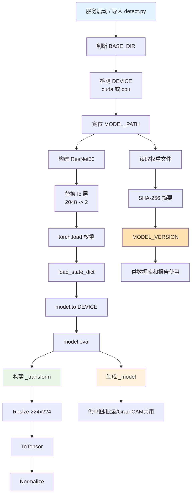
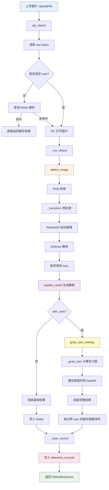
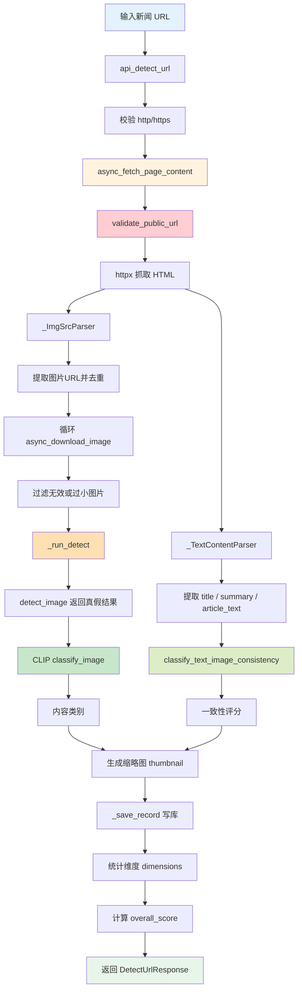
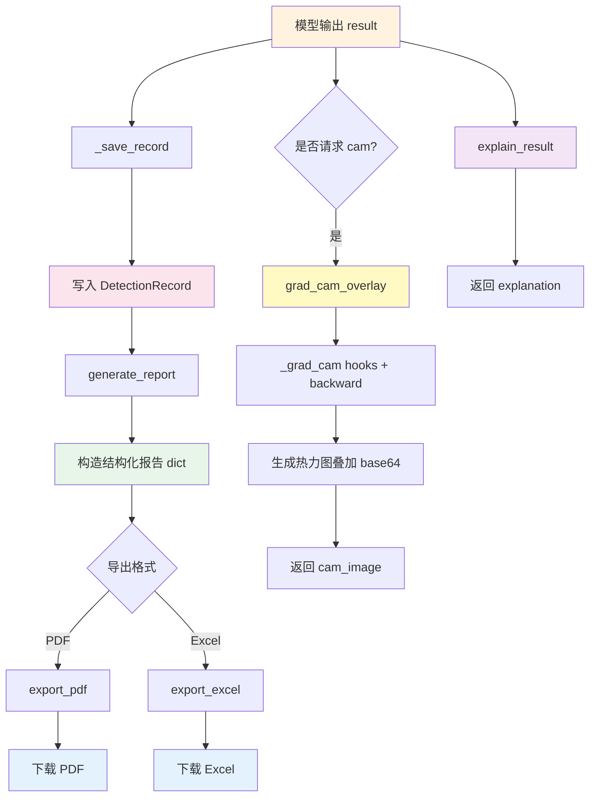
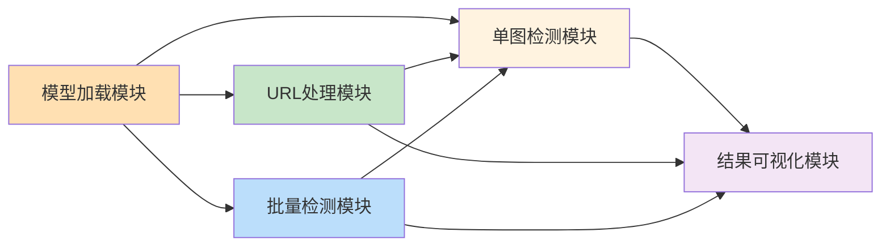

# AIGI-Holmes 五个核心模块数据流图（详细版）

本文档不再只给出概念层架构，而是按照仓库中的真实文件夹和核心文件，拆解系统的 5 个核心模块，并给出对应的数据流图。这样既能配合“数据流图”展示，也能直接映射到代码实现。

---

## 1. 核心模块与文件夹对应关系

| 核心模块 | 主要职责 | 对应文件夹 / 文件 |
|---|---|---|
| 模型加载模块 | 加载 ResNet50 权重、选择 CPU/GPU、初始化预处理管线、计算模型版本 | `detect.py`、`finetuned_fake_real_resnet50.pth` |
| 单图检测模块 | 对单张图片完成预处理、模型推理、概率计算、中文解释、Grad-CAM 生成 | `detect.py`、`backend/routers/detect.py` |
| URL 处理模块 | 对新闻页面 URL 做安全校验、HTML 解析、图片提取、图片下载、文本摘要抽取 | `detect.py`、`backend/routers/detect.py` |
| 批量检测模块 | 创建任务、解析上传文件、提取多图、逐张检测、缓存复用、WebSocket 推送进度 | `backend/routers/detect.py`、`backend/routers/ws.py`、`backend/job_store.py`、`detect_text.py` |
| 结果可视化模块 | 生成解释文本、叠加 Grad-CAM 热力图、持久化检测记录、导出 PDF/Excel 报告 | `detect.py`、`backend/models/detection.py`、`backend/report/`、`backend/routers/report.py` |

---

## 2. 系统总体设计

### 2.1 总体数据流总览

```mermaid
graph TD
    A[用户输入<br/>上传图片 / 输入URL / 上传批量文件] --> B[接口层<br/>FastAPI 路由]
    B --> C1[单图检测入口<br/>POST /api/detect]
    B --> C2[URL检测入口<br/>POST /api/detect-url]
    B --> C3[批量检测入口<br/>/api/detect-batch-init<br/>/api/detect-batch-run]
    B --> C4[报告入口<br/>/api/report/generate<br/>/api/report/{id}/export]

    C1 --> D[detect.py 核心能力]
    C2 --> D
    C3 --> D

    D --> E1[模型加载模块]
    D --> E2[单图检测模块]
    D --> E3[URL处理模块]
    D --> E4[批量检测模块]
    D --> E5[结果可视化模块]

    E2 --> F[DetectionRecord 持久化]
    E3 --> F
    E4 --> G[任务队列与 WebSocket]
    E5 --> H[PDF / Excel / 结构化结果]

    F --> I[数据库]
    G --> J[前端实时进度]
    H --> K[用户下载或页面展示]

    style A fill:#e3f2fd
    style B fill:#ede7f6
    style D fill:#fff3e0
    style I fill:#fce4ec
    style J fill:#e8f5e9
    style K fill:#e8f5e9
```

### 2.2 核心功能模块设计

系统在工程实现上并不是将“图片检测”写成单一的大函数，而是按照职责边界拆解为 5 个核心功能模块。这样的设计有两个直接目的：一是降低模块之间的耦合度，使模型推理、网页解析、批量处理、结果展示等能力可以独立演进；二是通过统一接口把复杂流程标准化，让上层接口层只关心“调用什么能力”，而不必关心底层的具体实现细节。

从调用关系上看，5 个模块并不是并列孤立存在，而是围绕“输入获取 - 算法推理 - 结果增强 - 业务输出”这一主链路协同工作。其中，模型加载模块位于最底层，为系统提供统一的推理资源；单图检测模块位于核心层，承担实际分类判定；URL 处理模块和批量检测模块位于输入扩展层，分别把网页场景和多文件场景转换为标准检测任务；结果可视化模块位于输出增强层，负责把模型分数加工为可解释、可展示、可导出的业务结果。

为了便于在论文、设计文档或答辩中说明，本系统 5 个模块可以进一步细化为以下内容。

#### 2.2.1 模型加载模块

模型加载模块负责完成检测系统运行前的全部初始化工作，是整个系统的底座模块。其核心职责包括：定位本地权重文件、构建 ResNet50 网络结构、替换输出层为二分类结构、根据当前运行环境自动选择 CPU 或 GPU、加载微调权重并切换到推理模式。同时，该模块还负责构建统一的图像预处理流水线，例如尺寸归一化、张量转换和标准化操作，以保证后续所有检测入口使用完全一致的输入规范。

该模块对外主要提供 _load_model() 接口，输出已经完成初始化的全局模型实例。此外，还会提供 DEVICE、_transform、MODEL_VERSION 等共享资源，分别用于设备调度、图像预处理和模型版本追踪。之所以将这些能力集中在一个模块中，是为了避免单图检测、批量检测、Grad-CAM 等多个功能重复创建模型对象，从而减少显存和内存开销，并保证各检测路径使用同一套参数和版本。

从接口依赖关系上看，模型加载模块本身不直接面向用户，而是作为基础能力被单图检测模块、批量检测模块和结果可视化模块共同调用。因此它属于“底层支撑模块”，其稳定性直接决定整个系统是否能够正常运行。

#### 2.2.2 单图检测模块

单图检测模块是系统的核心业务模块，也是整个检测链路中最关键的判定引擎。该模块接收一个 PIL 图片对象作为标准输入，内部依次完成 RGB 转换、图像预处理、模型前向推理、Softmax 概率计算、结果排序和标签解析，最终输出真假类别、中文标签、置信度、分类概率分布以及文字解释等结构化结果。

该模块对外暴露 detect_image() 接口，支持 with_cam 或 cam 开关参数，用于控制是否生成 Grad-CAM 可视化结果。在启用可视化时，模块会在完成基础推理后继续调用热力图生成逻辑，将模型关注区域叠加到原图之上，输出前端可直接展示的 base64 编码图片；在未启用可视化时，则仅返回轻量化检测结果，以降低计算开销。

单图检测模块的设计价值在于，它把“图片真假识别”封装成了一项标准能力。无论输入图片来自用户直接上传、网页解析下载还是批量文件提取，只要最终被转换为 PIL 图片对象，都可以统一交给 detect_image() 处理。这样不仅提高了复用性，也为后续批量检测和 URL 检测提供了统一的推理接口。

#### 2.2.3 URL 处理模块

URL 处理模块面向新闻网页、资讯页面等网络场景，其作用不是直接做分类，而是把一个网页地址转换为“可供检测的图片集合”和“可供分析的文本上下文”。该模块首先负责 URL 合法性校验，限制仅允许 http 或 https 协议访问；随后结合 SSRF 防护逻辑，对本地地址、私有地址、保留地址等危险目标进行拦截，防止系统被利用去访问内部网络资源。

在网页内容抓取成功后，该模块进一步完成 HTML 解析，从页面中的 img、source、meta 等标签提取图片地址，并通过 urljoin() 将相对路径统一转换为绝对路径。同时，模块还会提取标题、摘要和正文可见文本，为图文一致性分析提供辅助信息。对于得到的每个图片地址，模块通过 download_image() 或异步下载接口完成图片抓取、尺寸过滤和格式解码，最终得到可供单图检测模块调用的图片对象。

该模块对外提供 fetch_image_urls()、download_image() 等接口，其中前者负责网页中的图片地址收集，后者负责实际图片下载与解码。可以看出，URL 处理模块本质上是“输入转换模块”，其主要价值在于打通了网页场景与图像检测场景之间的通道，使系统不局限于本地图片上传，而能够支持新闻链接、网页页面等更贴近真实业务的应用形式。

#### 2.2.4 批量检测模块

批量检测模块建立在单图检测模块之上，主要解决多图片、多文件场景下的处理效率与交互体验问题。若系统仅提供单图接口，那么用户在一次提交多张图片时需要重复发起多次请求，既不利于前端交互，也会增加后端调度成本。因此，系统将多文件输入统一封装为批量任务，再通过队列和异步处理机制完成批量推理。

该模块对外提供 detect_batch() 接口，用于对多张图片执行批量前向推理。与单图检测相比，批量检测会先将多张图片统一执行预处理并堆叠为一个 batch tensor，再一次性送入模型完成推理，从而减少模型重复调度带来的性能损耗。在 Web 场景下，批量检测模块还会结合任务管理和 WebSocket 推送机制，将处理过程拆分为 start、result、complete 等阶段性事件，前端可以边接收结果边更新界面，而不必等待全部完成。

该模块的工程意义主要体现在两个方面：一方面，它提升了模型推理吞吐量，使系统能够处理更高频率的图片审查请求；另一方面，它通过任务队列、缓存复用和进度回传机制增强了系统的可用性，使批量处理不再是“黑盒等待”，而是可感知、可跟踪的连续流程。

#### 2.2.5 结果可视化模块

结果可视化模块负责把模型输出转化为用户可理解、业务可使用的结果信息，是系统从“算法判定”走向“业务落地”的关键一环。模型本身输出的只是类别概率分布，这种结果对普通用户或业务审核人员并不直观，因此需要通过可视化与解释逻辑进行增强。

该模块主要提供两个核心接口：grad_cam_overlay() 和 explain_result()。其中，grad_cam_overlay() 基于 Grad-CAM 方法生成热力图叠加结果，用于展示模型在判定过程中重点关注的图像区域，提高检测过程的可解释性；explain_result() 则根据标签与置信度区间生成中文说明文字，包括风险等级、结果摘要、可疑线索和免责声明等内容，用于帮助用户快速理解检测结论。

除上述两个显式接口外，结果可视化模块还承担结果增强和结果输出的职责，例如中文标签封装、置信度格式化、结果对象组织、检测记录持久化，以及与 PDF、Excel 报告导出链路的衔接。因此，该模块并不是单纯的“界面展示层”，而是一个面向业务表达的结果封装层，它显著提升了系统的可解释性、可审查性与可复核性。

#### 2.2.6 模块间接口关系与协同机制

从模块协同关系看，模型加载模块提供统一模型资源，是其他模块共享的基础；单图检测模块是核心处理中心，批量检测模块和 URL 处理模块都会在完成输入组织后调用它或复用其推理逻辑；结果可视化模块则附着在检测结果之后，对推理输出进行解释和增强。换言之，系统内部形成了“模型加载提供底座、检测模块输出结论、输入扩展模块组织数据、可视化模块增强结果”的分层协同结构。

这种设计方式具有较强的工程优势。首先，模块职责清晰，便于后期定位问题和替换实现，例如未来若更换为其他分类模型，只需调整模型加载模块和少量推理逻辑，而不必重写 URL 抓取或报告导出部分。其次，接口边界明确，便于测试和复用，例如 detect_image() 可单独进行单元测试，fetch_image_urls() 可单独验证安全性和抓取效果。最后，模块化设计也为后续功能扩展预留了空间，例如增加视频帧检测、更多结果解释规则或新的报告导出格式时，都可以在现有架构上平滑扩展。

综合来看，这 5 个核心模块共同构成了 AIGI-Holmes 的完整检测闭环。它们既保持了内部职责独立，又通过统一接口实现有序协同，使系统从输入获取、模型推理到结果解释和业务输出形成了清晰、稳定且易扩展的技术架构。

---

## 3. 模型加载模块

### 3.1 模块职责

模型加载模块是整个检测系统的底座，负责在服务启动时完成以下工作：

1. 确定运行目录，兼容普通 Python 环境与 PyInstaller 打包环境。
2. 检测当前设备，自动选择 CPU 或 GPU。
3. 构建 ResNet50 主干网络，并重写最后的全连接层为 2 分类输出。
4. 从本地权重文件 `finetuned_fake_real_resnet50.pth` 加载微调参数。
5. 将模型切换到 `eval()` 推理模式。
6. 构建统一的图像预处理流水线 `_transform`。
7. 计算模型文件的 SHA-256 摘要前 8 位，作为 `MODEL_VERSION`，用于数据库记录与报告输出。

### 3.2 输入与输出

- 输入：本地权重文件、当前运行环境、Torch 设备信息。
- 输出：全局推理模型 `_model`、设备对象 `DEVICE`、预处理器 `_transform`、模型版本 `MODEL_VERSION`。

### 3.3 对外提供的能力

- `_load_model()`：加载模型。
- `_compute_model_version()`：生成模型版本号。
- 全局变量 `_model`：供 `detect_image()`、`detect_batch()`、`_grad_cam()` 直接调用。

### 3.4 数据流图



### 3.5 代码落点

- `detect.py`
- `finetuned_fake_real_resnet50.pth`

---

## 4. 单图检测模块

### 4.1 模块职责

单图检测模块是系统最核心的业务模块。它接收上传的图片文件，完成缓存判断、图像解码、模型推理、概率排序、中文结果解释，并在需要时生成 Grad-CAM 热力图，最后把检测结果落库并返回给前端。

### 4.2 处理步骤说明

1. 路由 `POST /api/detect` 接收上传图片和 `cam` 参数。
2. 读取原始字节流 `raw`，为空则报错。
3. 若未请求 `cam`，优先查询 Redis 缓存，命中后直接返回。
4. 使用 PIL 打开图片并转为内部图像对象。
5. 调用 `_run_detect()`，本质上在线程池中执行 `detect_image()`。
6. `detect_image()` 内部完成 RGB 转换、Resize、Tensor 化、Normalize、模型推理、Softmax 概率计算。
7. 根据最高概率类别生成 `label`、`label_zh`、`confidence`、`probs`。
8. 调用 `explain_result()` 生成中文解释，包括等级、摘要、线索、免责声明。
9. 如果请求了 `cam=1`，则进入 `grad_cam_overlay()` 生成热力图叠加图。
10. 将结果写入 Redis 缓存，并通过 `_save_record()` 写入 `detection_records` 表。
11. 返回结构化响应，其中附带 `detection_id` 供报告模块继续使用。

### 4.3 输入与输出

- 输入：上传图片二进制、是否启用 Grad-CAM。
- 输出：
  - 标签：`FAKE` / `REAL`
  - 中文标签：`AI 生成` / `真实照片`
  - 置信度：最高类概率
  - 全部类别概率数组
  - 中文解释对象
  - 可选的 `cam_image`
  - 数据库记录 ID

### 4.4 数据流图



### 4.5 模块价值

这个模块把“图片二分类检测”封装成了标准能力。对上层来说，只需要调用一个接口，就能同时拿到判定结果、置信度、中文解释和可解释性热力图。

---

## 5. URL 处理模块

### 5.1 模块职责

URL 处理模块用于新闻页面检测。它不是简单地“下载一张图”，而是负责把一个网页地址转化为一组可检测图片，并尽量提取新闻标题、正文摘要、文章文本，为图文一致性分析提供上下文。

### 5.2 处理步骤说明

1. 路由 `POST /api/detect-url` 接收新闻页面 URL。
2. 首先校验 URL 是否以 `http://` 或 `https://` 开头。
3. 调用 `async_fetch_page_content()` 执行网页抓取。
4. 在抓取逻辑内部调用 `validate_public_url()`，拒绝本地地址、私有地址、保留地址，降低 SSRF 风险。
5. 使用 `_ImgSrcParser` 提取页面中 `img`、`source`、`meta` 标签中的图片地址。
6. 使用 `_TextContentParser` 提取页面标题、摘要、正文可见文本。
7. 对提取出的相对地址执行 `urljoin()` 转绝对地址，并去重，最多保留 `_MAX_IMAGES=10` 张图。
8. 每张图片调用 `async_download_image()` 下载，并过滤掉过小图片。
9. 下载成功后，对每张图执行单图检测 `_run_detect()`。
10. 并行附加 CLIP 内容分类 `classify_image()`。
11. 如果文章文本存在，则进一步调用 `classify_text_image_consistency()` 计算图文一致性得分。
12. 生成缩略图、累计分类统计、统计真假占比、平均置信度、一致性均值。
13. 每张图片结果写入数据库。
14. 最终返回页面级综合结果，包括 `page_title`、`page_summary`、`overall_score`、`dimensions`。

### 5.3 输入与输出

- 输入：新闻页面 URL。
- 输出：
  - 页面内图片检测结果列表
  - 页面标题与摘要
  - 类别统计
  - 真假比例
  - 平均置信度
  - 图文一致性均值
  - 综合评分

### 5.4 数据流图



### 5.5 模块价值

这个模块把“网页内容”转换成“可检测的图片集合 + 可用于分析的文本上下文”，是新闻场景下最关键的桥接层。

---

## 6. 批量检测模块

### 6.1 模块职责

批量检测模块面向一次上传多张图片或文档文件的场景。它负责创建任务、管理任务生命周期、提取图片、逐张检测、实时推送中间结果，使前端可以一边接收结果一边渲染，而不必等待全部处理完成。

### 6.2 组成子模块

- `api_detect_batch_init()`：创建任务，生成 `job_id`。
- `api_detect_batch_run()`：接收上传文件并启动后台协程处理。
- `_process_batch_run()`：真正执行批处理。
- `backend/job_store.py`：提供任务字典、队列、超时清理。
- `backend/routers/ws.py`：WebSocket 消费队列并实时向前端发送事件。
- `detect_text.py`：当上传的是文本、文档类文件时，从文件中提取图片。

### 6.3 处理步骤说明

1. 前端先调用 `/api/detect-batch-init` 获取 `job_id`。
2. 后端通过 `create_job()` 在内存中创建一个任务对象，内部包含 `asyncio.Queue`。
3. 前端携带 `job_id` 上传多个文件到 `/api/detect-batch-run`。
4. 后台协程 `_process_batch_run()` 开始处理文件列表。
5. 如果文件本身就是图片，则直接读入 PIL。
6. 如果文件是文本类或包含图片的文档，则调用 `extract_images_from_file()` 提取内部图片。
7. 每得到一张图片，就组织为统一结构：文件名、图像对象、原始字节、来源文件。
8. 处理开始时向队列发送 `start` 事件，告诉前端总数。
9. 逐张检测时先查 Redis 缓存，命中则直接复用。
10. 未命中则调用 `detect_batch([item["image"]])` 执行推理，这里虽然只包了一张图，但复用了批量接口的输出格式。
11. 同时异步执行 CLIP 分类和缩略图生成。
12. 每处理完一张图，就把 `result` 事件写入队列。
13. WebSocket 端点 `/ws/detect/{job_id}` 持续消费队列并向前端发送 JSON 事件。
14. 全部处理完成后发送 `complete` 事件。
15. 任务在 10 分钟后自动过期清理，避免内存常驻。

### 6.4 输入与输出

- 输入：多文件上传、任务 ID、用户令牌。
- 输出：
  - `start` 事件
  - 多个 `result` 事件
  - `item_skip` 事件
  - `complete` 事件

### 6.5 数据流图

```mermaid
graph TD
    A[前端请求批量检测] --> B[/api/detect-batch-init]
    B --> C[create_job]
    C --> D[job_store 保存 queue 和 user_id]
    D --> E[返回 job_id]

    E --> F[/api/detect-batch-run 上传 files]
    F --> G[_process_batch_run]
    G --> H{文件类型判断}
    H -->|图片| I[PIL 打开]
    H -->|文档/文本| J[extract_images_from_file]
    J --> K[拆出多张图片]
    I --> L[组装 items]
    K --> L

    L --> M[queue.put start]
    M --> N[逐项处理]
    N --> O{Redis 缓存命中?}
    O -->|是| P[复用缓存结果]
    O -->|否| Q[detect_batch 单张封装推理]
    P --> R[并发生成 category 和 thumbnail]
    Q --> R
    R --> S[queue.put result]
    S --> N
    N --> T[全部完成]
    T --> U[queue.put complete]

    D --> V[/ws/detect/{job_id}]
    V --> W[校验 token / user / role]
    W --> X[消费 asyncio.Queue]
    X --> Y[send_json 到前端]

    style A fill:#e3f2fd
    style C fill:#fff3e0
    style D fill:#fce4ec
    style G fill:#ffe0b2
    style Q fill:#ffecb3
    style V fill:#c8e6c9
    style Y fill:#e8f5e9
```

### 6.6 模块价值

这个模块解决的是“高交互批量处理”问题。它把耗时的图片解析和检测流程拆成了可流式反馈的任务队列，使系统在用户体验上更接近桌面审查工具，而不是普通表单提交页面。

---

## 7. 结果可视化模块

### 7.1 模块职责

结果可视化模块负责把模型输出变成“人可读、可展示、可导出”的结果。它不是再次做推理，而是对推理结果进行解释、增强和封装。

该模块主要包含四层能力：

1. 中文解释生成：把概率结果翻译为审查友好的说明文字。
2. 热力图可视化：把关注区域叠加到原图，形成 Grad-CAM 图。
3. 检测记录持久化：把结果写入数据库，形成可追踪的报告输入。
4. 报告导出：将检测结果导出为 PDF 和 Excel。

### 7.2 中文解释生成

`explain_result()` 根据标签和置信度区间进行规则匹配：

- FAKE 和 REAL 分别有不同的阈值规则表。
- 输出包括：`level`、`summary`、`clues`、`disclaimer`。
- 对 FAKE 结果，还会附加常见 AI 痕迹线索，如手指异常、纹理重复、光影不一致等。

### 7.3 Grad-CAM 热力图生成

`grad_cam_overlay()` 与 `_grad_cam()` 的处理流程如下：

1. 在 ResNet50 的 `layer4` 上注册前向和反向钩子。
2. 前向推理得到目标类别输出。
3. 反向传播得到目标类别关于特征图的梯度。
4. 计算通道权重并与激活图做加权求和。
5. 通过 ReLU 保留正贡献区域。
6. 将 7×7 的 CAM 上采样回原图尺寸。
7. 生成 RGBA 热力层并叠加到原图上。
8. 最终编码成 base64 JPEG 返回给前端。

### 7.4 报告导出

报告链路由以下部分组成：

- `backend/report/generator.py`：从数据库读取 `DetectionRecord`，构造结构化 `report dict`。
- `backend/report/exporter.py`：把 `report dict` 导出为 PDF 或 Excel 二进制内容。
- `backend/routers/report.py`：提供报告生成和下载接口。

PDF 报告包含：

- 标题
- 判定横幅
- 基本信息表
- 概率分布表
- 检测分析与建议

Excel 报告则更适合结构化复核和二次处理。

### 7.5 数据流图



### 7.6 模块价值

这个模块把“模型分数”转化成“可审查、可回溯、可下载”的成果物，是系统从算法能力走向业务落地的关键一步。

---

## 8. 五个核心模块之间的协同关系



协同逻辑可以概括为：

- 模型加载模块提供统一推理底座。
- 单图检测模块提供标准检测能力。
- URL 处理模块把网页场景转换为多张图片检测场景。
- 批量检测模块把多文件输入转换为流式任务处理场景。
- 结果可视化模块负责把检测结果解释、存档、导出。

---

## 9. 适合在答辩或文档中直接使用的总结表述

可以将这 5 个核心模块概括为：

1. 模型加载模块负责底层推理环境初始化，是算法运行基础。
2. 单图检测模块负责核心识别逻辑，是系统最核心的判定引擎。
3. URL 处理模块负责网页解析与图片抽取，是新闻场景的输入桥梁。
4. 批量检测模块负责多文件异步处理与进度推送，是工程化能力扩展。
5. 结果可视化模块负责解释、热力图、报告导出，是业务展示与审查落地层。

如果用于论文或答辩表述，可以进一步总结为一句话：

> AIGI-Holmes 通过“模型加载 + 单图检测 + URL 处理 + 批量检测 + 结果可视化”五级模块化设计，实现了从输入采集、算法推理到结果解释和报告导出的完整闭环。

---

## 10. 配图说明文字（可直接用于正文）

下面这组 PNG 图适合直接插入论文、汇报 PPT 或系统设计说明中。建议采用“图 + 说明文字”的方式配套展示。

### 图 1：五模块总体数据流总览

建议图题：AIGI-Holmes 五个核心模块总体数据流总览图

可配文字：

该图展示了系统从用户输入到结果输出的总体处理链路。用户可以通过上传图片、输入新闻 URL 或提交批量文件触发检测请求，后端路由进一步调用模型加载、单图检测、URL 处理、批量检测和结果可视化五个核心模块，最终将检测结果写入数据库并返回给前端页面或导出报告。该图主要用于说明系统整体结构和模块之间的依赖关系。

### 图 2：模型加载模块数据流图

建议图题：AIGI-Holmes 模型加载模块数据流图

可配文字：

该图描述了系统在启动阶段如何完成检测模型初始化。系统首先定位运行目录和权重文件路径，随后根据当前设备环境自动选择 CPU 或 GPU，并构建 ResNet50 网络结构，将最后的全连接层替换为二分类输出层。之后通过加载本地微调权重完成模型初始化，同时构建统一的图像预处理流程，并计算模型版本号，为后续检测记录和报告导出提供版本追踪能力。

### 图 3：单图检测模块数据流图

建议图题：AIGI-Holmes 单图检测模块数据流图

可配文字：

该图展示了单张图片检测的完整处理流程。系统在接收上传图片后，先读取原始字节流并进行缓存判断；若缓存未命中，则将图片解码为 PIL 对象并执行预处理操作，包括 RGB 转换、尺寸缩放和归一化。随后图像被送入 ResNet50 模型进行前向推理，通过 Softmax 计算获得真假类别概率，并生成中文解释结果。在用户请求可解释性输出时，系统进一步执行 Grad-CAM 计算与热力图叠加，最终返回结构化检测结果并完成数据库持久化。

### 图 4：URL 处理模块数据流图

建议图题：AIGI-Holmes URL 处理模块数据流图

可配文字：

该图反映了新闻页面 URL 到可检测图片集合的转换过程。系统首先对用户输入链接进行协议合法性和 SSRF 安全校验，随后使用异步 HTTP 请求抓取页面 HTML 内容，并从中解析图片地址、标题、摘要及正文文本。系统会对图片地址进行绝对路径补全和去重，再逐张下载有效图片并调用单图检测模块进行真假判定。同时，系统还结合 CLIP 模块完成内容分类和图文一致性分析，最终输出页面级综合检测结果。

### 图 5：批量检测模块数据流图

建议图题：AIGI-Holmes 批量检测模块数据流图

可配文字：

该图展示了多文件批量检测的任务化处理流程。前端首先调用任务初始化接口获取任务编号，后端在内存中创建包含异步队列的任务对象。用户上传多个文件后，系统根据文件类型决定是直接读取图片还是从文本、文档中提取嵌入图片。随后系统逐项执行缓存检测、批量推理封装、缩略图生成和类别分析，并将阶段性结果持续写入任务队列。WebSocket 服务端则不断消费队列消息并推送给前端，实现批量检测过程中的实时反馈。

### 图 6：结果可视化模块数据流图

建议图题：AIGI-Holmes 结果可视化模块数据流图

可配文字：

该图说明了系统如何将模型输出转换为可读、可展示和可导出的业务结果。系统先根据真假标签和置信度生成中文解释，再在需要时执行 Grad-CAM 热力图计算并叠加原图，以提升检测结果的可解释性。与此同时，系统会将检测记录写入数据库，并通过报告生成模块构造结构化报告对象，最终支持导出 PDF 和 Excel 等格式，满足新闻审核与结果留档场景下的展示和归档需求。

### 配图文件位置

新版 matplotlib 导出的图片建议统一使用以下文件：

- `数据流图/matplotlib图表/00_五模块总体数据流总览.png`
- `数据流图/matplotlib图表/01_模型加载模块数据流.png`
- `数据流图/matplotlib图表/02_单图检测模块数据流.png`
- `数据流图/matplotlib图表/03_URL处理模块数据流.png`
- `数据流图/matplotlib图表/04_批量检测模块数据流.png`
- `数据流图/matplotlib图表/05_结果可视化模块数据流.png`
